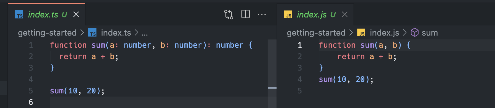

## Typescript Install

```typescript
npm i typescript -g
```

## TSC
> 타입스크립트 컴파일에서 index.ts 파일을 index.js 파일로 변환한다.




- `Duplicate function implementation.` 에러
  타입스크립트를 구현하다보면 작성한 함수명에 밑줄로 에러가 뜨는걸 볼 수 있다.
  이는 vs code의 버그이다.
  <b>해결법</b>: 터미널에 `tsc --init` 명령어를 입력하면 tsconfig.json 파일이 생성되며 에러가 없어진다.

## tsconfig.json
> ts 파일들을 js 파일로 어떻게 변환할지에 대한 세부설정이 가능하다.

```typescript
{
  // 컴파일 시 부가적인 옵션
  "compilerOptions": {
    "allowJs": true, // 프로젝트 안에 Js를 허용하겠다
    "checkJs": true, // @ts-check ts의 타입 검사 기능을 js에 적용하겠다
    "noImplicitAny": true // 기본적인 타입 필수
  },
  "include": ["src/**/*"],
  "exclude": ["node_modules", "**/*.spec.ts"]
}
```